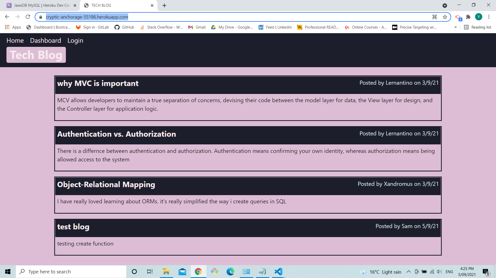
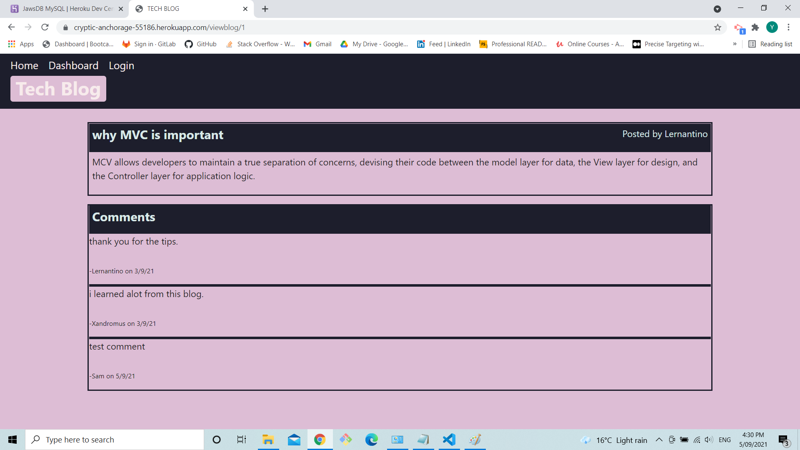
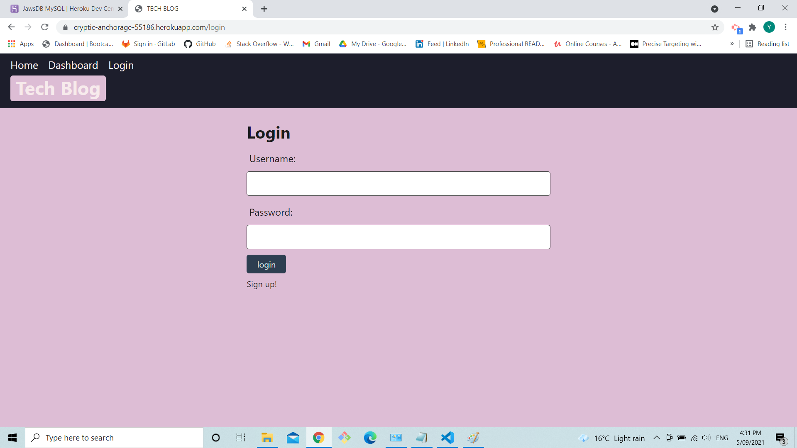
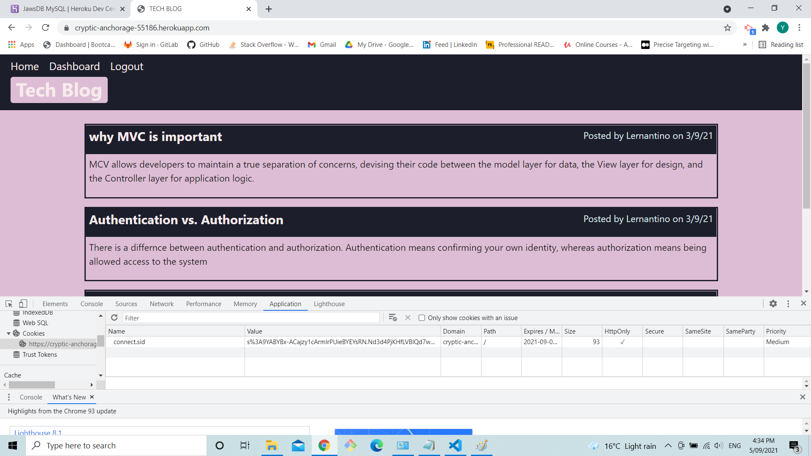
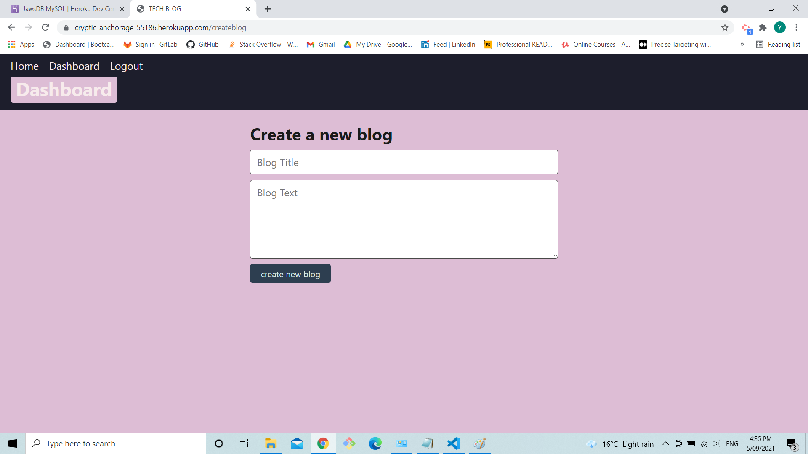
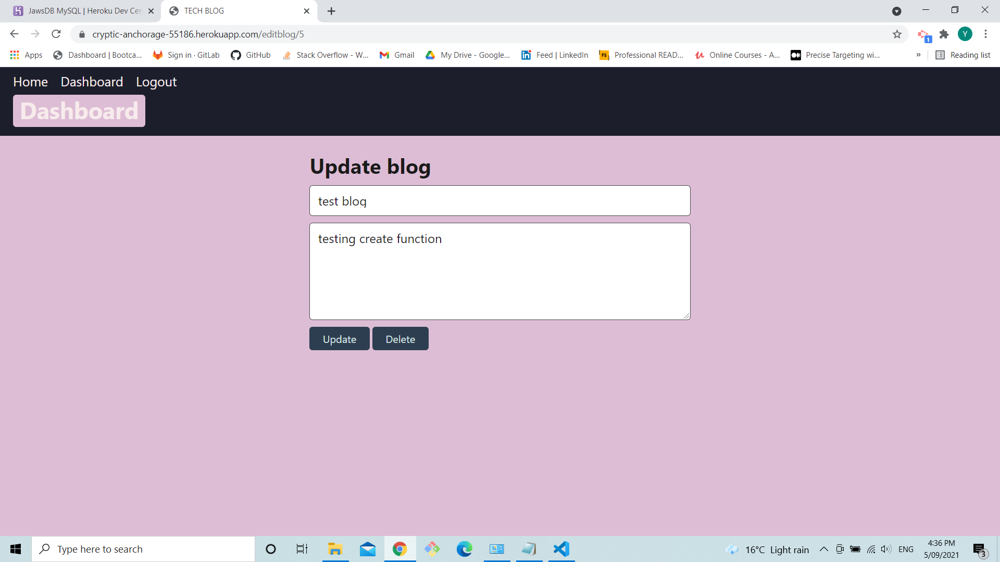
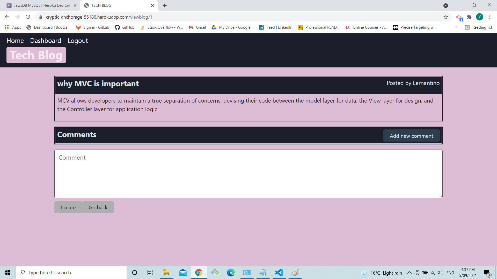

# 14 Model-View-Controller (MVC): Tech Blog

## Task
Task this week was to build a CMS-style blog site similar to a Wordpress site, where developers can publish their blog posts and comment on other developers’ posts as well.
 
## URL

https://cryptic-anchorage-55186.herokuapp.com/

you can you the Sam , password123 to login in or sign up

## Work

1. when the page is first loaded a small search box and a empty dashboard is shown.

2. when blog is clicked without logging in the user can see comment on the blog but unable to add

3. when the user clicks the dashboard or the login the user in taken to a login page where you can choose to login or sign up

4. when the user is logged in a cookies with the session is created and the login changed to logout

5. after logging in the user can access the to create or to edit the previous blogs and when create is clicked a input shows up

6. when the user click the blog an update form appear contain the blog values which you can edit or delete the blog

7. when the user is logged in a add comment button appears in the comment section
